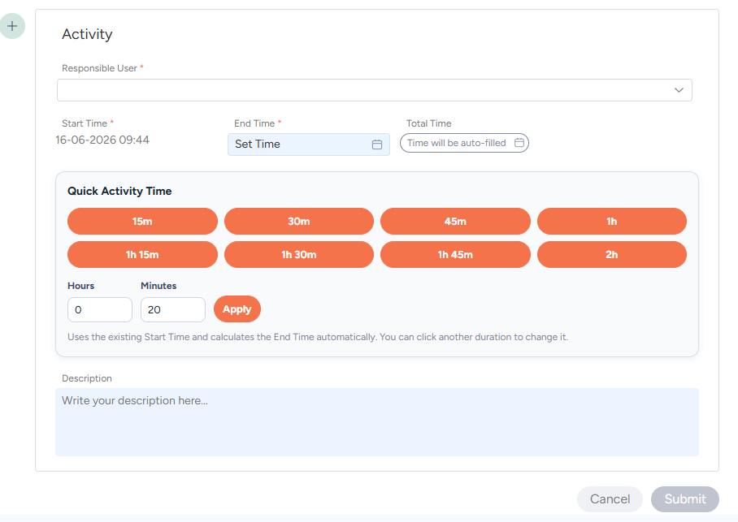

# SysAid Activity Quick Time Buttons

Adds quick duration buttons to SysAid Activity entries, automatically calculating End Time from the existing Start Time.

Built as a lightweight Tampermonkey userscript for SysAid administrators, with easy colour customisation and no hardcoded tenant branding.

---

## Screenshot



> Replace the image above with your own screenshot file stored in:
>
> ```
> /images/screenshot.png
> ```

---

## Install

[](https://raw.githubusercontent.com/YOURUSERNAME/sysaid-activity-quick-time-buttons/main/sysaid-activity-quick-time-buttons.user.js)

Click the button above and Tampermonkey should automatically detect the userscript and prompt you to install it.

---

## Features

✅ One-click duration buttons

- 15 minutes
- 30 minutes
- 45 minutes
- 1 hour
- 1 hour 15 minutes
- 1 hour 30 minutes
- 1 hour 45 minutes
- 2 hours

✅ Custom Hours / Minutes entry

✅ Automatically calculates End Time from Start Time

✅ Works directly inside the SysAid Activity editor

✅ No server-side installation required

✅ Easy colour customisation

✅ Tampermonkey auto-update support

✅ Generic and reusable across SysAid environments

---

## Requirements

- Google Chrome
- Microsoft Edge
- Mozilla Firefox
- Tampermonkey Browser Extension

### Install Tampermonkey

Download Tampermonkey from:

https://www.tampermonkey.net/

---

## Installation

### Option 1 - One Click Install

1. Install Tampermonkey.
2. Click the install badge above.
3. Tampermonkey will detect the userscript.
4. Click **Install**.

---

### Option 2 - Manual Installation

1. Install Tampermonkey.
2. Download or clone this repository.
3. Open:

```text
sysaid-activity-quick-time-buttons.user.js
```

4. Click **Raw** on GitHub.
5. Tampermonkey will prompt to install.
6. Click **Install**.

---

## URL Matching

By default the script uses:

```javascript
// @match https://*/spaces/ticket*
```

This allows the script to work on most SysAid environments.

If you prefer to lock it to your own SysAid instance:

```javascript
// @match https://helpdesk.company.com/spaces/ticket*
```

---

## Customising Button Colours

Near the top of the script you will find:

```javascript
const BUTTON_COLOURS = {
    background: '#fe6c43',
    border: '#fe6c43',
    text: '#ffffff',
    hoverBackground: '#ff805f',
    hoverShadow: 'rgba(254, 108, 67, 0.25)'
};
```

### Blue Theme Example

```javascript
const BUTTON_COLOURS = {
    background: '#2563eb',
    border: '#2563eb',
    text: '#ffffff',
    hoverBackground: '#3b82f6',
    hoverShadow: 'rgba(37, 99, 235, 0.25)'
};
```

### Green Theme Example

```javascript
const BUTTON_COLOURS = {
    background: '#16a34a',
    border: '#16a34a',
    text: '#ffffff',
    hoverBackground: '#22c55e',
    hoverShadow: 'rgba(22, 163, 74, 0.25)'
};
```

### SysAid Orange Theme Example

```javascript
const BUTTON_COLOURS = {
    background: '#fe6c43',
    border: '#fe6c43',
    text: '#ffffff',
    hoverBackground: '#ff805f',
    hoverShadow: 'rgba(254, 108, 67, 0.25)'
};
```

---

## Customising Quick Duration Buttons

Near the top of the script:

```javascript
const QUICK_MINUTES = [15, 30, 45, 60, 75, 90, 105, 120];
```

### Example

To show:

- 10 minutes
- 20 minutes
- 30 minutes
- 1 hour
- 2 hours
- 3 hours

Use:

```javascript
const QUICK_MINUTES = [10, 20, 30, 60, 120, 180];
```

---

## How It Works

1. Open a SysAid ticket.
2. Create or edit an Activity.
3. Ensure Start Time is populated.
4. Click one of the duration buttons.
5. The script calculates the End Time.
6. The SysAid date picker is updated automatically.
7. Save the Activity as normal.

---

## Known Limitation

The script intentionally does **not overwrite an existing End Time**.

Once SysAid has already populated the End Time field, the underlying Material UI date picker changes behaviour and becomes unreliable to automate consistently.

To change a duration:

1. Clear the existing End Time.
2. Reopen the Activity editor.
3. Apply a new duration.

This behaviour is intentional and improves reliability across SysAid versions.

---

## Auto Updates

To enable automatic updates via Tampermonkey, configure the metadata block in the userscript:

```javascript
// @downloadURL https://raw.githubusercontent.com/YOURUSERNAME/sysaid-activity-quick-time-buttons/main/sysaid-activity-quick-time-buttons.user.js
// @updateURL   https://raw.githubusercontent.com/YOURUSERNAME/sysaid-activity-quick-time-buttons/main/sysaid-activity-quick-time-buttons.user.js
```

Whenever a new version is published, increment:

```javascript
// @version 0.6
```

Tampermonkey will automatically detect updates.

---

## Repository Structure

```text
sysaid-activity-quick-time-buttons/
│
├── images/
│   └── screenshot.png
│
├── sysaid-activity-quick-time-buttons.user.js
├── README.md
├── LICENSE
└── CHANGELOG.md
```

---

## Changelog

### v0.5

- Removed tenant-specific branding.
- Added configurable button colours.
- Added configurable quick-duration buttons.
- Simplified behaviour for improved reliability.
- Prevented overwriting existing End Times.
- Improved documentation.

---

## License

MIT License

Feel free to modify, redistribute and adapt the script to suit your own SysAid environment.

---

## Contributing

Pull requests, bug reports and suggestions are welcome.

If SysAid changes the Activity editor structure in future releases, please open an issue with:

- SysAid version
- Browser version
- Screenshot of the Activity editor
- Browser console errors (if any)

This helps keep the script working across SysAid releases.
